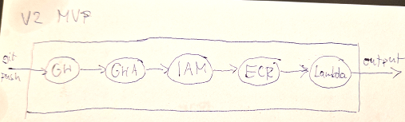
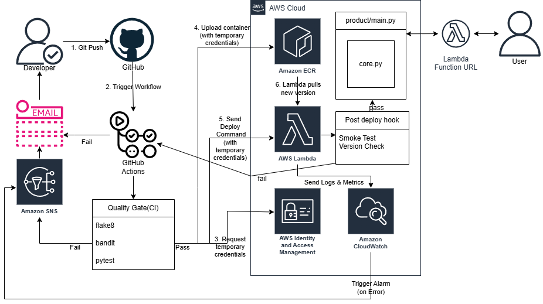
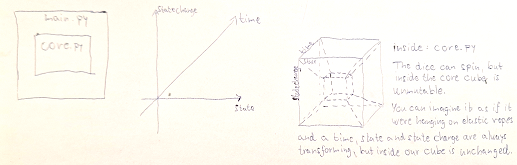

# v2 - Agnostic Serverless Lambda Core

**🏆 Professional Upgrade: From v1 Monolith to v2 Agnostic Serverless Architecture.**

This repository represents the high-performance evolution of the **[v1 baseline](https://github.com/szelese/ci-cd-gha-aws)**. The original v1 project was selected and validated by the **Hungarian National Innovation Agency (NIÜ)** for its innovative approach to cloud efficiency. By transitioning to this **v2 Cloud-Native Serverless** design, the system achieved a **2.7x increase in response speed** while maintaining a completely **Cloud-Agnostic** core.

---

## 🏛️ Architectural Evolution

This version focuses on **Latency Reduction** and **Operational Cost Optimization**. The business logic is now fully decoupled from the infrastructure using a Hexagonal (Agnostic) design pattern, representing the **Minimum Viable Product (MVP)** of the v2 design phase.

### Performance Comparison: v1 vs. v2

| Feature | v1 (Baseline) | v2 (Upgraded) | Improvement |
| :--- | :--- | :--- | :--- |
| **Infrastructure** | Elastic Beanstalk (EC2) | **AWS Lambda (Serverless)** | No Idle Costs |
| **Framework** | Monolithic Django | **Python Agnostic Core** | Zero Overhead |
| **Median Latency** | ~120 ms | **44 ms** | **~63% Faster** |
| **Scaling** | Instance-based | **Event-driven (Horizontal)** | Instant Scaling |
| **Deployment** | CI/CD Monolith | **Dockerized FaaS** | Higher Portability |

---

## ⚡ Technical Highlights

### 1. Architecture & Workflow

This diagram illustrates the complete CI/CD process from a developer pushing code to the application being live on AWS.

### 2. Hexagonal "Agnostic" Design
The core logic: `core.py` is completely independent of the AWS runtime. The `main.py` acts strictly as a Lambda Adapter. This ensures the core business logic remains **protected and isolated** from the infrastructure environment, making the system highly portable and testable without cloud dependencies.

### 3. Verified Performance (Locust)

[Image of Serverless Architecture]

Under heavy load testing, the system maintained a consistent **44 ms median response time**. 
* **Throughput:** Validated up to 600+ RPS.
* **Service Quotas:** Identified current ceiling at 150-180 concurrent users due to default AWS Soft Limits, proving horizontal scalability potential.

### 4. Production-Ready Security
* **OWASP ZAP:** 0-alert vulnerability status verified.
* **Hardened Headers:** Built-in HSTS, X-Content-Type-Options, and Cache-Control protection.
* **Observability:** Real-time health monitoring via CloudWatch Alarms and SNS notification chain.

---

## 📖 Documentation & Reproduction

Detailed technical guides for reproduction and audit:
* **[v2 Step-by-Step Guide](./v2-stepbystep.docx):** Complete manual reproduction guide.
* **[v2 Test & Audit Results](./v2-tests.docx):** Detailed performance and security analysis.
* **[Locust HTML Report (150 users)](./v2_performance_report_150.html):** Performance baseline before AWS soft limit.
* **[Locust HTML Report (1000 users)](./v2_performance_report.html):** Raw performance data for the high-concurrency test.

---

## 🚀 Future Roadmap: v3 (Infrastructure as Code)

While v2 perfected the **Technical Core**, the deployment remains manual to ensure architectural validation.
* **Terraform Integration:** Fully automated multi-environment (Dev/Test/Prod) setup.
* **Automated Rollback:** Implementing self-healing deployment strategies (Canary/Blue-Green).
* **DORA Metrics:** Transitioning from manual to automated MTTR and Deployment Frequency tracking.

> **Note on MTTR:** At this PoC upgrade phase, MTTR is manual. Automated self-healing is intentionally deferred to the **v3 phase** to maintain focus on raw performance metrics.

---

## ✍️ Author & Legal
**Ervin Széles** © 2026. This project is a professional architectural upgrade. Re-use or modification requires prior permission.